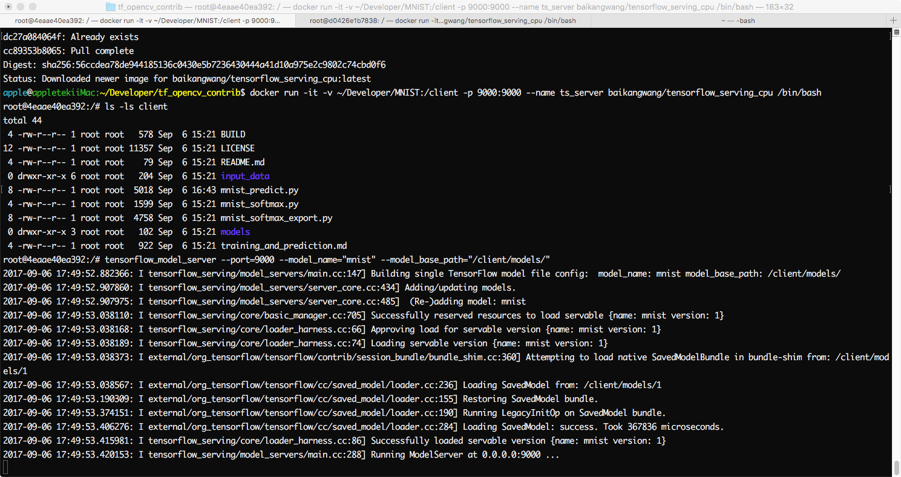
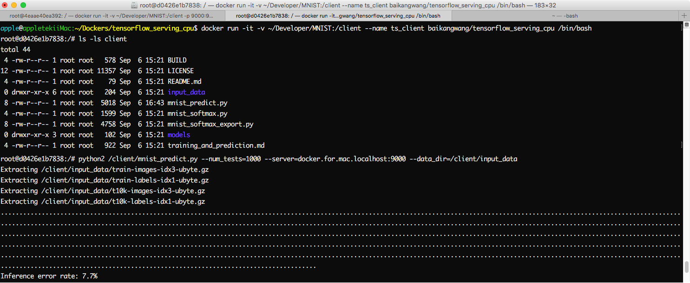

# Tensorflow serving (gpu)

## Description

This image can be used as tensorflow serving server and client

## Docker pull

```bash
docker pull baikangwang/tensorflow_serving_gpu[:3.5]
```

## Dockerfile

<https://github.com/EverDockers/tensorflow_serving_gpu/blob/python3/Dockerfile>

## Component

* grpc 1.6.0
* Python 3.5
* Tensorflow 1.3.0
* Tensorflow Serving 1.3.0

## Usage

> Tensorflow Serving - Server
```bash
nvidia-docker run -it -v <local working dir>:/projects -p 9000:9000 --name <ts_server> baikangwang/tensorflow_serving_gpu:3.5 /bin/bash 
```
> Tensorflow Serving - Client

```bash
# console, desktop program
nvidia-docker run -it -v <local working dir>:/projects --net=host --name <ts_client> baikangwang/tensorflow_serving_gpu:3.5 /bin/bash
 
# web app
nvidia-docker run -it -v <local working dir>:/projects --net=host -p 8080:8080 --name <ts_client> baikangwang/tensorflow_serving_gpu:3.5 /bin/bash
```

> `<local working dir>`: it's a placeholder presenting the client code directory  
> `<ts_server>`: it's a placeholder presenting the container name being played as _SERVER_ role  
> `<ts_client>`: it's a placeholder presenting the container name being played as _CLIENT_ role  
> `9000:9000`: the serving service port, the server part is configurable with the evn variable `$SERVING_PORT`  
> `8080:8080`: the client app port which is optional for console, desktop programs, the server part is configurable with the evn variable `$CLIENT_PORT`  

## Tensorflow serving tasks

### Run Server

```bash
tensorflow_model_server --port=9000 --model_name=<model_name> --model_base_path=/projects/<trained_model_path>
```

### Run Client

> console, desktop program

```bash
python[3] /projects/<predict.py> --<args>=... --server=localhost:9000
```

> web app

```bash
python[3] /projects/<web_predict_host.py> --<args>=... --server=localhost:9000 --port=8080
```

### Example

Take the tensorflow serving tutorial, [Serving a TensorFlow Model](https://www.tensorflow.org/serving/serving_basic) for example,
This tutorial introduce how to serving a trained model through bazel build, but in this image the tensorflow serving installed using binary so the code needs a little bit of updates,
see [baikangwang/MNIST](https://github.com/baikangwang/MNIST) for updated codes.

#### Prerequisites
```bash
cd /
git clone git@github.com:baikangwang/MNIST.git
ls -lsa /MNIST
```

#### Create Container

> Server

```bash
nvidia-docker run -it -v /MNIST:/projects -p 9000:9000 --name ts_server baikangwang/tensorflow_serving_gpu:3.5 /bin/bash
```

> Client

```bash
nvidia-docker run -it -v /MNIST:/projects --name --net=host ts_client baikangwang/tensorflow_serving_gpu:3.5 /bin/bash
```

#### Run

> Server

```bash
tensorflow_model_server --port=9000 --model_name="mnist" --model_base_path="/projects/models/"
```



> Client

```bash
# Mac
python /projects/mnist_predict.py --num_tests=1000 --server=docker.for.mac.localhost:9000 --data_dir=/projects/input_data

# linux
python /projects/mnist_predict.py --num_tests=1000 --server=localhost:9000 --data_dir=/projects/input_data
```

